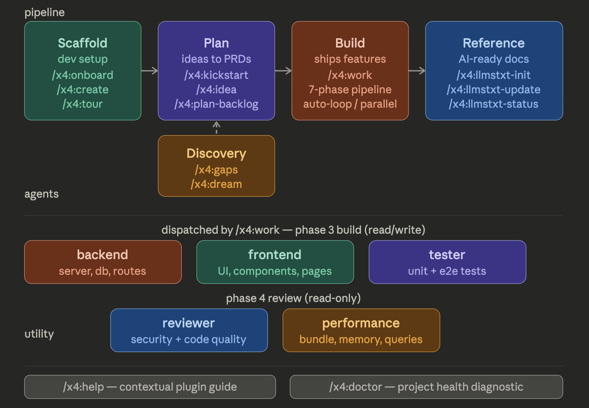

# x4-agent-plugins

A Claude Code plugin marketplace for the complete AI-powered development workflow: project scaffolding, backlog management, agent team coordination, and reference documentation.



## How It Works

The `x4` plugin provides a complete pipeline from idea to shipped PR:

| Stage | Command | What happens |
|-------|---------|--------------|
| **Onboard** | `/x4:onboard` | Check tools, accounts, CLI access — get your machine ready |
| **Scaffold** | `/x4:create my-app` | Create a full-stack TypeScript monorepo (Next.js, Hono, Expo, etc.) |
| **Tour** | `/x4:tour` | Guided walkthrough — test login, try AI chat, explore your app |
| **Kickstart** | `/x4:kickstart` | Brainstorm features, design UI, prioritize, batch-generate PRDs |
| **Build** | `/x4:work` | Dispatch an agent team, build, review, verify, ship |

## Getting Started

### 1. Install Claude Code

If you don't have Claude Code yet, install it from [claude.ai/download](https://claude.ai/download) or via:

```bash
npm install -g @anthropic-ai/claude-code
```

### 2. Add the marketplace and install the plugin

```bash
# Add the x4 plugin marketplace
/plugin marketplace add studiox4/x4-agent-plugins

# Install the x4 plugin
/plugin install x4@x4-agent-plugins
```

### 3. Run the onboarding wizard

```bash
/x4:onboard
```

This checks your machine for everything you need and walks you through setup:

| Requirement | Why | Free tier? |
|-------------|-----|------------|
| **Bun** >= 1.1 | Package manager + runtime | Open source |
| **Node.js** >= 18 | Required by some tooling | Open source |
| **Git** | Version control | Open source |
| **GitHub CLI** (`gh`) | PR management, CI watching | Free |
| **Neon** account | Serverless PostgreSQL with branch-per-PR | Yes (0.5 GB, 190 compute hrs/mo) |
| **Railway** account | Hosting + preview environments | Yes ($5/mo credit) |
| **Vercel** account | Next.js frontend deploys | Yes (personal projects) |
| **Anthropic API key** | AI features in your app | Pay-as-you-go |

The onboarding wizard detects what's already installed and only walks through what's missing.

### 4. Create your first project

```bash
/x4:create my-app
```

Choose a preset:
- **saas** — Web + API + AI (most common)
- **full-stack** — Everything: web, API, mobile, desktop, AI, marketing, docs
- **landing** — Web + API + marketing site
- **api-only** — Hono + tRPC backend microservice

The wizard handles environment setup (database, auth secrets, AI keys), then you're ready:

```bash
cd my-app
bun dev        # Web on :3000, API on :3002, Marketing on :3001
```

### 5. Kickstart your project

```bash
/x4:kickstart                                      # Brainstorm features, design UI, generate PRDs
/x4:work                                           # Agent team builds, reviews, ships
```

Or add features incrementally:

```bash
/x4:idea "Add user dashboard with analytics"     # Capture the idea
/x4:plan-backlog                                   # Brainstorm → plan → write PRD
/x4:work                                           # Agent team builds, reviews, ships
```

---

## A Day in the Life

Here's what using x4 actually looks like for a developer building a real app.

### Day 1 — From zero to a working app

```
/x4:onboard
```
Checks for Bun, Node, Git, the GitHub CLI, Railway, Neon, Vercel, and your Anthropic API key. Walks through anything missing. Installs companion plugins. Takes a few minutes once.

```
/x4:create my-fitness-app
```
Picks a preset (`saas`, `full-stack`, `landing`, or `api-only`). Scaffolds a Turborepo monorepo with Next.js, Hono/tRPC, Drizzle, Neon, Better Auth, and Vercel AI SDK. Sets up your `.env`, runs the initial migration, and opens dev servers.

```
/x4:deploy-setup
```
Detects your apps, generates `railway.toml`, syncs env vars to Railway, and walks through GitHub connection and PR preview setup. After this, every PR gets a live preview URL automatically.

```
/x4:tour
```
Guided walkthrough — opens the app in your browser, tests login, tries the AI chat, sets up the GitHub remote.

### Day 1 (continued) — Planning everything you want to build

```
/x4:kickstart
```
One command kicks off a full planning session:
1. **Vision** — "I'm building a fitness tracker with AI coaching for busy professionals"
2. **Brainstorm** — Claude generates a categorized feature list, you refine interactively
3. **Prioritize** — features sequenced by dependency and value
4. **UI Design** — page layouts and component specs for each user-facing feature
5. **Batch PRDs** — a full Product Requirements Document generated for every feature
6. **Summary** — "You have 8 PRDs ready. Run `/work` to start building."

### Day 2 — Agent teams build your features

```
/x4:work
```
Picks up the next PRD, dispatches three agents in parallel — backend, frontend, tester — and two reviewers after:

```
Phase 1: Orient    — pick a PRD, analyze dependencies
Phase 2: Setup     — create feature branch, DB branch, draft PR
Phase 3: Build     — backend + frontend + tester work in parallel
Phase 4: Review    — reviewer + performance agents audit the code
Phase 5: Ship      — push, CI passes, PR preview live
Phase 6: Memory    — changelog entry written, lessons logged
Phase 7: Cleanup   — PRD moved to complete, branch cleaned up
```

**Auto-loop mode:** If you have multiple PRDs ready, `/work` asks:
```
You have 8 PRDs ready.
  1. Build the next one
  2. Build all of them — auto-loop through each
  3. Build independent PRDs in parallel (experimental)
```

Pick option 2, walk away, come back to 8 merged features and a real app.

### Week 2 — Discovering what to build next

```
/x4:gaps
```
Scans completed features and surfaces what's missing: "You have workout logging but no export or progress visualization. Users can log in but can't reset their password."

```
/x4:dream
```
Explores bigger ideas across three angles:
- **What if** — bold moves: "What if users could share workout plans publicly?"
- **What's next** — natural evolutions: "Workout streaks and achievement badges"
- **What's emerging** — untapped stack capabilities: "Neon branching + AI could power personalized plan generation per user"

Select the ideas you like → they go straight to the backlog.

```
/x4:plan-backlog
```
Triage the backlog, pick an item, brainstorm it, write a PRD. Then `/work` again.

### Ongoing — Announcing what shipped

After each batch of merged features, run the announce workflow:

```
/x4:market-update   → update the marketing site with new features
/x4:market-email    → write a release email → review it → send to your list
/x4:market-linkedin → generate a LinkedIn post → copy → paste
/x4:market-tweet    → generate an X/Twitter thread → copy → paste (or --post)
```

All four read from `docs/CHANGELOG.md` — the file that `/work` writes to automatically after every feature ships.

### Ongoing — Brand updates

Your brand evolves. Open `brand/BRAND.md` in any editor and change what you need — voice, logos, social handles, email config. All marketing skills pick up the changes automatically next time they run.

### Ongoing — Keeping everything healthy

```
/x4:doctor          → health check: tools, config, agents, env, database, version, docs
/x4:upgrade         → apply migrations after updating the plugin
/x4:llmstxt-update  → refresh AI reference docs after adding a new library
/x4:status          → running apps, ports, git state at a glance
```

---

## Commands

All commands live under the `/x4:` namespace.

### Scaffolding

Scaffold and manage [x4-mono](https://github.com/corbanb/x4-mono) full-stack TypeScript monorepo projects.

| Command | Description |
|---------|-------------|
| `/x4:onboard` | Check tools, accounts, CLIs — set up your dev environment |
| `/x4:create [name]` | Scaffold a new project (presets: full-stack, saas, landing, api-only) |
| `/x4:tour` | Guided walkthrough — explore apps, test login, try AI chat, set up git |
| `/x4:add` | Add a mobile or web app to an existing project |
| `/x4:env` | Set up environment variables (database, auth, AI keys) |
| `/x4:status` | Quick project health dashboard — apps, ports, database, git, plugins |

**Tech stack created:** Next.js 15 + React 19 + Tailwind 4 / Hono + tRPC 11 + Drizzle ORM / Neon PostgreSQL / Better Auth / Vercel AI SDK + Claude / Expo 52 / Electron 33 / Turborepo + Bun

### Project Tracking

Backlog capture, triage, PRD generation, and project status tracking.

| Command | Description |
|---------|-------------|
| `/x4:kickstart` | Brainstorm features, design UI, prioritize, and batch-generate PRDs |
| `/x4:idea <idea>` | Capture a feature idea to the backlog |
| `/x4:plan-backlog` | Triage backlog → brainstorm → plan → write PRD |
| `/x4:init-tracker` | Scaffold STATUS.md, BACKLOG.md, `planning/{todo,in-progress,complete}/` |

### Agent Team Ops

Agent team coordination, feature dispatching, review cycles, and hook-based guardrails.

| Command | Description |
|---------|-------------|
| `/x4:work` | 7-phase pipeline: Orient → Setup → Build → Review+Verify → Ship → Memory Sweep → Cleanup |
| `/x4:run-tests` | Run configured test commands (unit, e2e, lint, typecheck) |
| `/x4:init-setup` | Interactive wizard to configure database, hosting, CI, tests |
| `/x4:init-agents` | Generate project-specific agent files from templates |
| `/x4:verify-local` | Run all checks with auto-fix (max 3 attempts) — mandatory ship gate |
| `/x4:pr-create` | Create branch + DB branch + draft PR + preview setup |
| `/x4:pr-status` | Check CI, preview URLs, and review state |
| `/x4:pr-cleanup` | Post-merge cleanup: delete DB branch + local branch |

**Agent Templates:**

| Agent | Role |
|-------|------|
| backend | Server-side code, database schema, API routes |
| frontend | UI code, components, pages, styling |
| reviewer | Read-only code review (security, architecture, quality) |
| tester | Unit tests and e2e tests |
| performance | Read-only performance audit (bundle, re-renders, memory, queries, cache) |

### LLMs.txt Management

Scan project dependencies, discover llms.txt documentation endpoints, download and manage AI-readable reference docs.

| Command | Description |
|---------|-------------|
| `/x4:llmstxt-init` | Scaffold download script, known-sources cache, docs directory, config |
| `/x4:llmstxt-update` | Full scan, discover, download, and sync (uses script if present) |
| `/x4:llmstxt-status` | Read-only status report of current docs |

---

## Configuration

Config files in `.claude/`:

| Feature | Config File | Generated By |
|---------|-------------|--------------|
| Project tracking | `.claude/project-tracker.config.md` | `/x4:init-tracker` |
| Agent team ops | `.claude/agent-team.config.md` | `/x4:init-setup` |
| LLMs.txt | `.llmstxt.json` | `/x4:llmstxt-init` |

All settings have sensible defaults. Configuration is optional to get started.

## External Plugin Dependencies

Some features integrate with official Claude plugins when installed:

| Plugin | Used By | For |
|--------|---------|-----|
| `superpowers@claude-plugins-official` | `/x4:plan-backlog` | Delegates to `/brainstorming` and `/writing-plans` |
| `code-simplifier@claude-plugins-official` | `/x4:work` Phase 4 | Simplifies complex code after review |

These are optional — features degrade gracefully with inline alternatives when plugins aren't installed.

## Auto-suggest the plugin for your team

Add this to your project's `.claude/settings.json` so team members are prompted to install:

```json
{
  "extraKnownMarketplaces": {
    "x4-agent-plugins": {
      "source": {
        "source": "github",
        "repo": "studiox4/x4-agent-plugins"
      }
    }
  },
  "enabledPlugins": {
    "x4@x4-agent-plugins": true
  }
}
```

## Local Development

```bash
# Test the marketplace locally
/plugin marketplace add ./path/to/x4-agent-plugins

# Validate marketplace structure
claude plugin validate .

# Run structural checks
bash tests/validate.sh

# Link the plugin for iterative development
claude plugin link ./plugins/x4
```

## License

Apache 2.0
